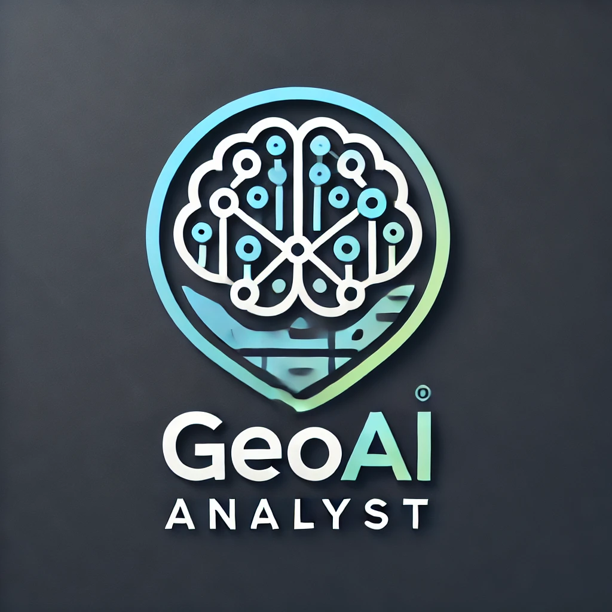
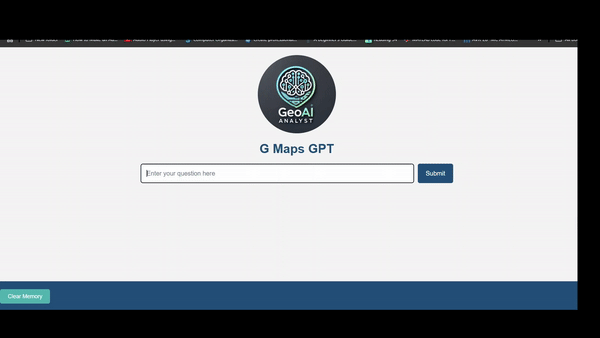

# G Maps GPT

G Maps GPT is an intelligent assistant for querying and analyzing condominium data in Miami. It leverages natural language processing (NLP) to interpret user questions and provide actionable insights about condo buildings, units, sales, and market trends. Aimed at simplifying real estate data analysis, this tool is designed for real estate agents and investors who are not technically inclined, allowing them to make informed decisions quickly and easily.

## Supported Markets
- **South Beach**
- **Miami Beach**
- **South of Fifth**

## Purpose
Enable high-level analyses of real estate data for non-technical users, aiding investment decisions with ease and efficiency.

---
## Demo

## Features
- **Natural Language Interface**: Query condo data in plain English.
- **Google Maps Integration**: Location-based queries with visual results on interactive maps.
- **Dynamic SQL Generation**: Handles complex database queries dynamically.
- **Interactive Visualization**: Maps, charts, and graphs for enhanced understanding.
- **PDF Reporting**: Generate detailed PDF reports for offline analysis.
- **Error Handling**: Vector embeddings and fuzzy logic for spelling corrections and relevant results.

---

## Technologies Used
- **Python 3.x**: Core programming language.
- **Flask**: Web framework for the application.
- **Neon Tech**: Serverless PostgreSQL for scalable database management.
- **LangChain & LangGraph**: Agents for handling NLP tasks.
- **OpenAI GPT Models**: Natural language understanding and query generation.
- **Google Maps API**: Geocoding, directions, and location-based data.
- **Chart.js**: For creating interactive charts and graphs.
- **ReportLab**: PDF generation library.
- **Render**: Deployment platform.

---

## Usage
1. **Ask Questions**: Enter natural language questions about Miami condos.
2. **Interactive Responses**: Receive data-driven answers with maps, charts, and graphs.
3. **PDF Reports**: Generate comprehensive PDF reports for deeper insights.
4. **Clear History**: Use the "Clear Memory" button to reset the conversation history.

---

## Sample Queries
- "What buildings on Collins had the highest number of sales in 2023?"
- "Put the data in an HTML table."
- "Add another column with the closest school to each building and the driving distance between the building and that school."
- "Generate a PDF report with this data."
- "Generate a Google map with markers for each building and each school."
- "What is the average holding period for 2-bedroom units excluding Brickell?"
- "Can you generate a graph of building name and driving distance?"

---

## Project Structure
- **server.py**: Flask application server.
- **main.py**: Core logic for processing questions and generating responses.
- **tools.py**: Utilities for database querying and API interactions.
- **prefix.py**: Curated prompts to guide the AI agent.
- **boilerplate.py**: Code for generating maps and charts.

---

## Other Features
1. **Spelling Correction**: Vector embeddings and fuzzy logic (using FAISS and difflib) correct errors in user input.
2. **Scalability**: Serverless PostgreSQL dynamically scales with traffic.
3. **Stateful Conversations**: Maintains context for up to 3 messages for coherent interactions.
4. **Prompt Engineering**: Tailored prompts to reduce hallucinations (though some may still occur).
5. **Secure Querying**: Read-only database permissions and code filtering to prevent malicious commands.
6. **GitHub Integration**: Deployment is integrated with version control.

---

## Application Link
[Try G Maps GPT](https://gmaps-gpt.onrender.com)

---

## Drawbacks
1. **Limited Data**: The tool uses a sample database and covers a specific geographic area.
2. **Context Limitations**: Supports a small conversation window (up to 3 messages).
3. **Prefixed Prompts**: Highly specific to this use case, which may limit adaptability.
4. **Chart Download**: Work in progress for downloading charts as part of PDF reports.
5. **Hallucinations**: GPT models may generate inaccurate or irrelevant answers during prolonged conversations.

---

## Future Improvements
- Expanding the database for broader market coverage.
- Increasing context window for more robust conversations.
- Enabling chart downloads directly in PDF reports.
- Refining prompt engineering and google maps real time integration to reduce hallucinations.

---

